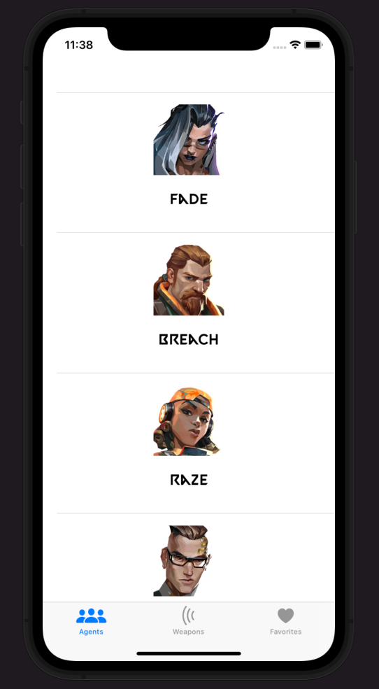
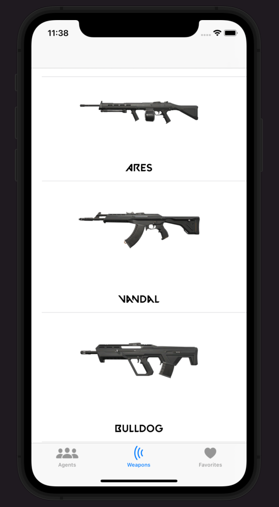
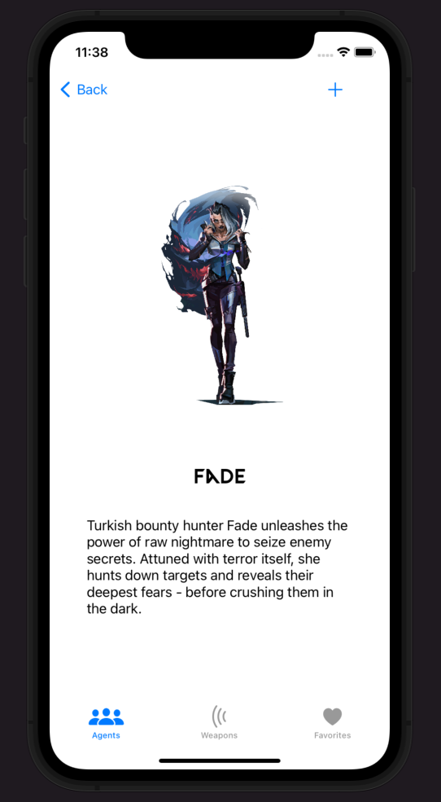
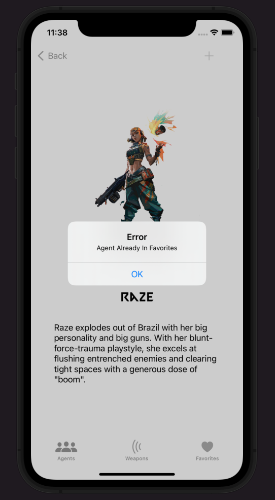
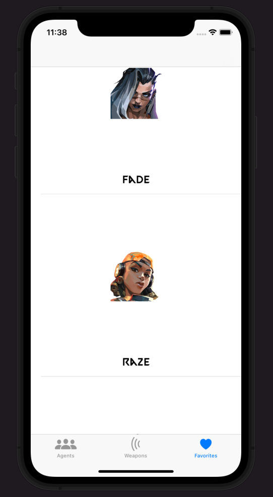

<h1 align="center">
  :zap: Valorant Wiki iOS :zap:
</h1>
<h2>
  About :grey_question:
</h2>

  This is an app that shows users details about Valorant Agents and weapons.

<h2>
  Flow :ocean:
</h2>

  When you start the app it welcomes you with fetched agents from the API. The user can go into their detail page by clicking on the card. There are 3 tabs in the app called "Agents,Weapons,Favorites". In agent detail screen user can click on the add button and add that agent to favorites. You can't add the same agent to favorites twice, the app shows you an alert when you do that. In favorites tab user can delete agents from favorites by swiping.

<h2>
  Screenshots :camera_flash:
</h2>

<h3>
  Main Screen
</h3>

<h3>
  Weapons
</h3>

<h3>
  Agent Detail
</h3>

<h3>
Alert
</h3>

<h3>
Favorites
</h3>

